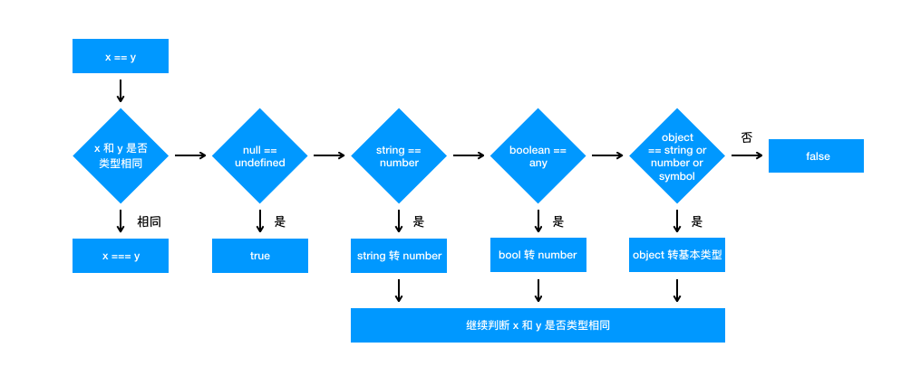

<!--
 * @Author: cuixiang cuixiang405@gmail.com
 * @Date: 2024-01-07 20:21:13
 * @FilePath: /js-basic-knowledge/2024-01/== operator.md
 * @Description: 
-->
# The type coercion rules of the == operator

When using ==, if the types of the two operands are different, the type conversion will be performed. If you compare whether x and y are the same, the following judgment process will be performed:

1. First, **check** if their **types** are the same. If same, compare their values. If not same, do the type conversion as follows.
2. **Check** if we are comparing **null and undefined**. If so, return true.
3. **Check** if the types of both are **string and number**, if so, the string will be converted to number.
4. To **determine** whether one of the parties is a **boolean**, if so, it will change the boolean to number and then make a judgment.
5. **Determine** if one of the elements is an **object** and the other is a string, number, or symbol. If so, the object will be converted to its primitive type before the comparison.

```js
// boolean
'1' == true
        ↓
'1' ==  1
        ↓
 1  ==  1

// object
'1' == { name: 'js' }
        ↓
'1' == '[object Object]'
```

The flow chart is as follows:


